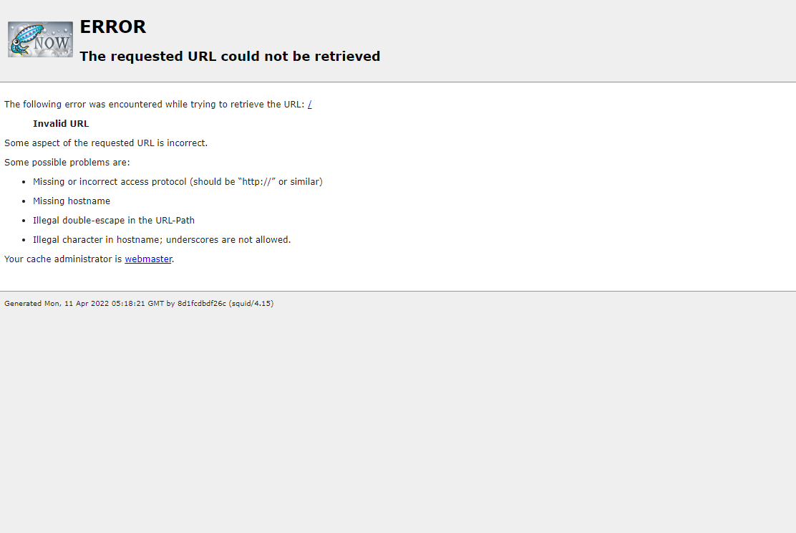

🌙 docker-squid
====

## 📗 プロジェクトの概要

DockerでSquidを利用したProxyサーバーのデモ環境を構築します。

## 🌐 Demo




## 📦 ディレクトリ構造

```
.
├── docker
│   ├── squid （Proxyサーバー）
│   ├── app （Appサーバー）
│   └── docker-compose.yml
└── dc.sh （Dockerの起動用スクリプト）
```

## 🖊️ Docker 操作用シェルスクリプトの使い方

```
Usage:
  dc.sh [command] [<options>]

Options:
  stats|st                 Dockerコンテナの状態を表示します。
  init                     Dockerコンテナ・イメージ・生成ファイルの状態を初期化します。
  start                    すべてのDaemonを起動します。
  stop                     すべてのDaemonを停止します。
  app login                App にログインします。
  --version, -v     バージョンを表示します。
  --help, -h        ヘルプを表示します。
```


## 💬 使い方

```
# 下準備
$ ./dc.sh init

# Dockerを起動する
$ ./dc.sh start

# Appサーバーにログインします
$ ./dc.sh app login

# この時点ではインターネットにアクセスできることを確認します
curl google.com 

# Default Gateway のルーティングを削除してHTTP プロキシを経由しないとインターネットに出れない環境を作ります
route
route delete default

# インターネットにアクセス出来なくなります
curl google.com 

# Proxyサーバーを経由する場合はインターネットにアクセスできることを確認します
curl google.com -x http://squid:3128

# デフォルトのプロキシを設定することでオプション指定無しでアクセスできるようになります
export http_proxy=http://squid:3128
export https_proxy=${http_proxy}
curl google.com 

# Dockerを停止する場合
$ ./dc.sh stop
```

## 🎨 参考

| プロジェクト| 概要|
| :---------------------------------------| :-------------------------------|
| [アプリケーションのHTTPプロキシのテスト環境を作る](https://qiita.com/megmogmog1965/items/9101a6c91bdce6d43aa4)| アプリケーションのHTTPプロキシのテスト環境を作る |


## 🎫 Licence

[MIT](https://github.com/isystk/docker-squid/LICENCE)

## 👀 Author

[isystk](https://github.com/isystk)
